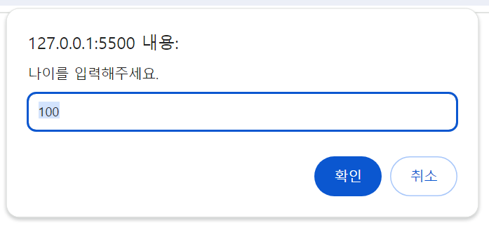
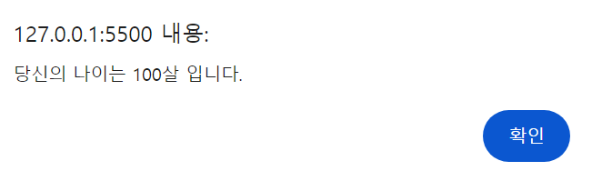
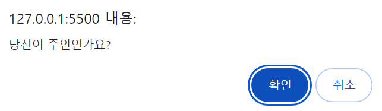
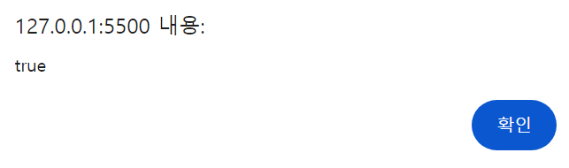

# alert, prompt, confirm을 이용한 상호작용

## alert
- 사용자가 확인 버튼을 누를때까지 메시지를 보여주는 창이 계속 떠있게함.
- modal window -> 메시지가 있는 작은창, 페이지의 나머지 부분과 상호작용이 불가.
```js
alert("hello");
```
## prompt
- 프롬프트 대화상자에 원하는 값을 입력하고 확인을 누르거나
입력을 원하지 않는 경우 취소,또는 Esc를 눌러 대화상자를 빠져나감.

- 두개의 인수를 받음
    - `title` :사용자에게 모여줄 문자열
    - `default`: 입력필드의 초깃값(선택값)
```js
result= prompt(title,[default]);
```
- 사용자가 입력필드에 기재한 문자열을 반환하며, 입력을 취소한 경우 null이 반환됨.
ex)
```js
let age = prompt('나이를 입력해주세요.', 100);

alert(`당신의 나이는 ${age}살 입니다.`); // 당신의 나이는 100살입니다.
```
실행 결과


+) 인수를 감싸는 대괄호`[...]`는 선택값을 의미함.

## 컨펌 대화상자
```js
result=confirm(question);
```
- 매개변수로 받은 질문과 확인 취소 버튼이 있는 모달창을 보여줌
- 확인은 누르면 true, 그외의 경위 false를 반환함.
```js
let isBoss = confirm("당신이 주인인가요?");

alert( isBoss ); // 확인 버튼을 눌렀다면 true가 출력됩니다.
```


